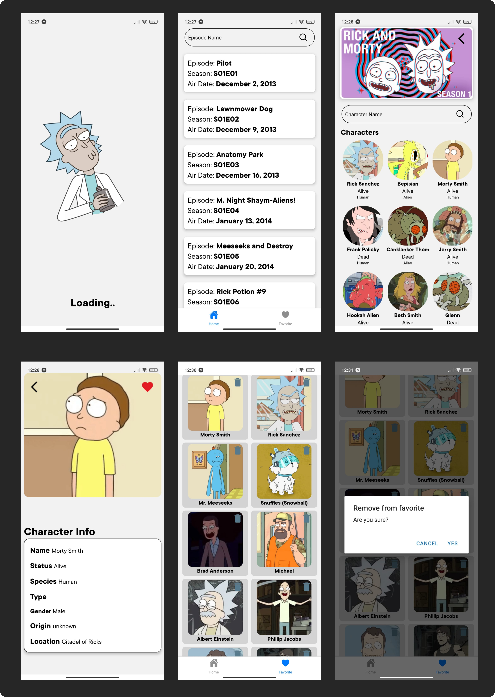

# Application Name [Rick And Morty]
Rick And Morty is a mobile application developed using React Native Expo. Below you can find more information about the technologies used and the purpose of the app.
 


## Technologies and Libraries Used

**React Native Expo:** The framework that forms the basis of the application.

**TypeScript:** :  Providing type safety in the development process.

**AsyncStorage:** In-app data storage and access.

**Redux** and **AsyncThunk:** : State management and asynchronous operations.

**Axios:** For efficient and flexible HTTP requests.

**React Navigation:** For navigation between pages.

**Lottie:** For adding visual appeal to the application.

## API Usage

#### Rick and Morty API

[API Link](https://rickandmortyapi.com/)
  
## Run on your computer

Clone the project

```bash
  git clone https://github.com/ozturksirin/rick-and-morty.git
```

Go to the project directory

```bash
  cd rick-and-morty
```

Install the required packages

```bash
  npm install
```

Operate

```bash
  npx expo start
```  
## Screenshots



## Demo


# --------------------------[TR]------------------------

# Uygulama Adı [Rick And Morty]
Rick And Morty, React Native Expo kullanılarak geliştirilmiş bir mobil uygulamadır. Aşağıda kullanılan teknolojiler ve uygulamanın amacı hakkında daha fazla bilgi bulabilirsiniz.
 


## Kullanılan Teknolojiler ve Kütüphaneler

**React Native Expo:** Uygulamanın temelini oluşturan çerçeve.

**TypeScript:** :  Geliştirme sürecinde tip güvenliği sağlama.

**AsyncStorage:**  Uygulama içi veri saklama ve erişim.

**Redux** ve **AsyncThunk:** : Durum yönetimi ve asenkron işlemler.

**Axios:** Verimli ve esnek HTTP istekleri için.

**React Navigation:** Sayfalar arası gezinme için.

**Lottie:** Uygulamaya görsel çekicilik katmak için.
  
## API Kullanımı

#### Rick and Morty API

[API Bağlantısı](https://rickandmortyapi.com/)
  
## Bilgisayarınızda Çalıştırın

Projeyi klonlayın

```bash
  git clone https://github.com/ozturksirin/rick-and-morty.git
```

Proje dizinine gidin

```bash
  cd rick-and-morty
```

Gerekli paketleri yükleyin

```bash
  npm install
```

Çalıştırın

```bash
  npx expo start
```  

## Ekran Görüntüleri


## Demo


  ## Lisans

[MIT]([https://choosealicense.com/licenses/mit/](https://github.com/ozturksirin/rick-and-morty?tab=MIT-1-ov-file))
 
